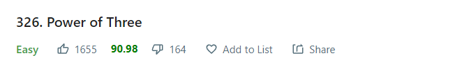
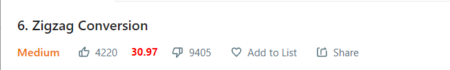

  
  
  # leetcode-like-percentage-extension
  Shows the like percentage of question alongside other details

 
 
 

## Example

  
 
 

> ### **This extension is not YET available on Chrome Store**

> To run this project on your system, clone the project and Load unpacked in your browser extension management tab
